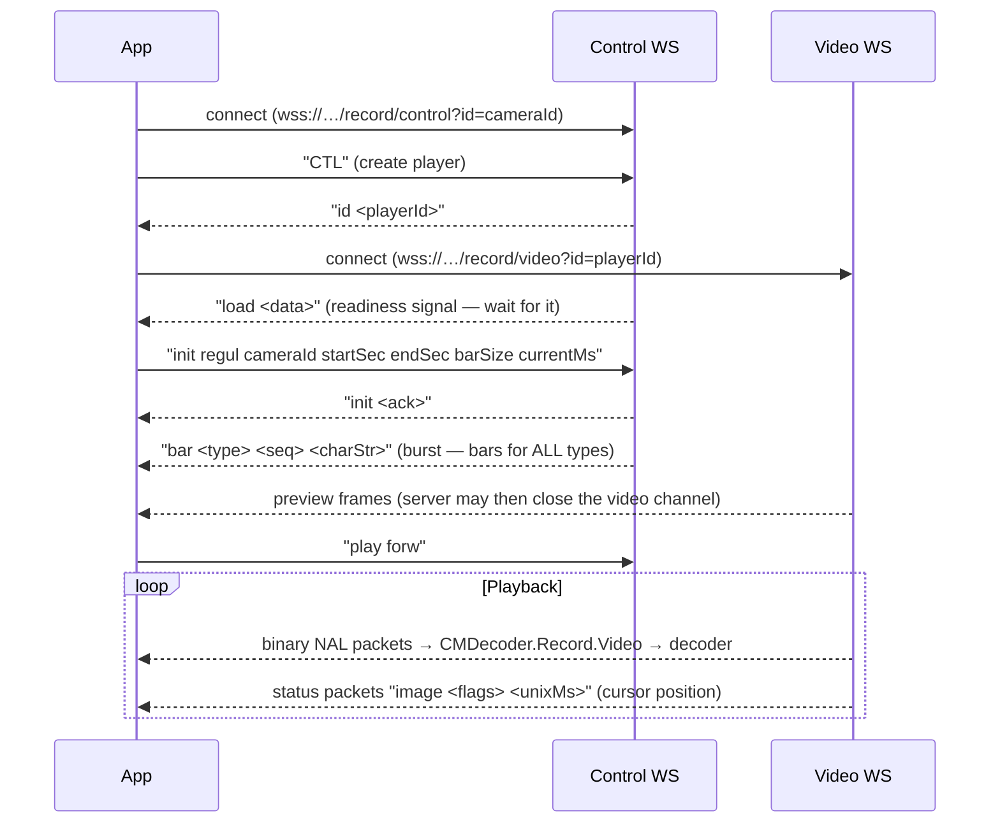

# Advanced — Record Playback

Playing recorded video from a CamTrace server requires two WebSocket connections opened in a strict sequence, plus an initialization handshake before playback can start.

## How it works



**Key constraints:**

1. The video WebSocket URL is only known after the server responds with a player ID (`id` event) — wait for it before opening the second connection.
2. Wait for the `load` event before sending `init` (use a ~2 s fallback timeout for servers that don't send it).
3. Do **not** send `type` during initialization — the bar type is already the first argument of `init`, and `type` would trigger a second decoder initialization on the video channel.
4. After `init`, the server pushes a burst of non-timestamped preview frames on the video channel, then **may close that channel**. Reopen it with the same `playerId` before the next play command.

`PlaybackPlayer` from `@camtrace/streaming` handles all four constraints for you.

## Using `PlaybackPlayer` (recommended)

```js
import CamtraceApi        from '@camtrace/api'
import { PlaybackPlayer } from '@camtrace/streaming'
import WebDecoder         from '@camtrace/web-video-decoder'

const cm = await CamtraceApi.loadApis('192.168.1.100', 443, true)
await cm.simpleLogin('admin', 'password')
const cameras = await cm.cameras()
const cam     = cameras[0]

const canvas = document.getElementById('video')
const player = new PlaybackPlayer(cm, cam.id, { DecoderClass: WebDecoder })
player.attach(canvas)

// Recording window (adapt to your UI)
const barName    = 'regul'        // 'regul' (regular) or 'alarm' recordings
const startSec   = Math.floor(Date.now() / 1000) - 2 * 3600   // Unix seconds
const endSec     = Math.floor(Date.now() / 1000)
const barSize    = 1000           // timeline resolution (number of bar units)
const currentSec = startSec       // initial playhead position (Unix seconds)

player.on('ready', () => {
  // init sent — timeline events will follow, preview frames are on their way
})

player.on('time', posSec => {
  // Current position in Unix seconds (from video-channel status packets
  // and control-channel time events)
  updateCursor(posSec)
})

player.on('bar', ([type, seq, charStr]) => {
  // Timeline data — fired once per bar type right after init
  if (type === barName) renderTimeline(charStr)
})

// autoOpenVideo: true opens the video channel before init, so the server's
// automatic preview burst is decoded and displayed immediately.
await player.start(barName, startSec, endSec, barSize, currentSec, { autoOpenVideo: true })
```

### Playback commands

```js
await player.play()          // play forward (opens the video channel if needed)
await player.backward()      // play backward
player.stop()                // stop; the control channel stays open for resume
await player.stepForward()   // next frame  (only while stopped)
await player.stepBackward()  // previous frame (only while stopped)
player.seek(pos)             // jump to a bar unit (0..barSize)
player.setTime(ts)           // jump to a timestamp
player.setSpeed(freq)        // playback rate in fps — see "Speed control"
player.close()               // release both WebSocket connections
```

`play()`, `backward()`, `stepForward()` and `stepBackward()` are async because they reopen the video channel if the server closed it after the preview burst.

### Speed control

The server reports the real frame rate of the recording via the `rfreq` event. The `freq` command sets the playback rate in frames per second, so a UI speed multiplier translates as `multiplier × rfreq`:

```js
let realFreq = 25
player.on('rfreq', r => { realFreq = parseInt(r) || realFreq })

function setSpeedMultiplier(multiplier) {   // 1, 2, 4, 8…
  player.setSpeed(Math.round(multiplier * realFreq) || 1)
}
```

### Rendering the timeline (`bar` events)

Each `bar` event carries one character per bar position (`charStr.length === barSize`):

| Character | Meaning |
|-----------|---------|
| `\0` | No recording |
| `'A'` / `'a'` | Surveillance-zone marker — **not** a recording |
| `'r'` / `'R'` | Recording present (protected) |
| Any other non-null char | Recording present |

```js
function hasRecording(ch) {
  return ch && ch !== 'A' && ch !== 'a' && ch.charCodeAt(0) > 0
}

function renderTimeline(charStr) {
  for (let i = 0; i < charStr.length; i++) {
    if (hasRecording(charStr[i])) {
      // bar unit i covers [startSec + i/barSize × (endSec−startSec), …]
    }
  }
}
```

Bars for **all** types (`regul`, `alarm`, …) arrive in the burst following `init` — cache them per type so a type switch can redraw the timeline without waiting for the server.

### Switching bar type (regular ↔ alarm)

The `type` command (`player.setBarType(type, currentSec)`) switches the *preview* stream, but playback keeps using the type given at `init`. To switch the playback type, close the player and run the full sequence again with the new bar name:

```js
async function switchType(newType) {
  player.close()
  player = new PlaybackPlayer(cm, cam.id, { DecoderClass: WebDecoder })
  player.attach(canvas)
  // re-register event listeners…
  await player.start(newType, startSec, endSec, barSize, currentSec, { autoOpenVideo: true })
}
```

A complete working implementation (timeline rendering, cursor, type switch, transport controls) ships with the demo: `apps/demo/src/views/playback.js`.

## Using low-level services

If you need more control, use `services` directly:

```js
import { services }  from '@camtrace/streaming'
import WebDecoder    from '@camtrace/web-video-decoder'

const decoder = new WebDecoder()
const canvas  = document.getElementById('video')
const ctx     = canvas.getContext('2d')

// Step 1 — open control channel, send CTL, wait for player ID
await services.openControlRecordService(cm, cam.id, async (ctrlService, playerId) => {

  // Step 2 — register the load listener BEFORE opening the video channel,
  // so an early fire is not missed
  const loadFired = new Promise(resolve =>
    ctrlService.cmDecoder.on('load', resolve))

  // Step 3 — open the video channel now that the player ID is known
  const vidService = await services.openVideoRecordService(cm, playerId)

  vidService.cmDecoder.on('packet', pck => {
    if (pck.name === 'status') {
      // "image <flags> <unixMs>" — current position in Unix ms
      const parts = pck.data.toString().split(' ')
      if (parts[0] === 'image') console.log('position:', parseInt(parts[2]) / 1000)
      return
    }
    if (pck.name === 'audio') return   // never feed audio packets to the video decoder
    decoder.sendPacket(pck, canvas.width, canvas.height, true)
  })

  decoder.on('decodeddata', ({ rgbData, width, height }) =>
    ctx.putImageData(
      new ImageData(new Uint8ClampedArray(rgbData), width, height), 0, 0))

  // Step 4 — wait for the server's readiness signal, then initialize
  await Promise.race([loadFired, new Promise(r => setTimeout(r, 2000))])
  ctrlService.cmDecoder.init('regul', cam.id, startSec, endSec, barSize, currentSec * 1000)

  // Step 5 — timeline events
  ctrlService.cmDecoder.on('bar', ([type, seq, charStr]) => console.log('bar:', type))
  ctrlService.cmDecoder.on('time', t => console.log('position:', t))

  // Step 6 — playback commands
  ctrlService.cmDecoder.playForward()
  document.getElementById('pause').onclick = () => ctrlService.cmDecoder.stop()
  document.getElementById('seek').onclick  = () => ctrlService.cmDecoder.goto(targetBarUnit)
})
```

## `init()` parameters

| Parameter | Type | Description |
|-----------|------|-------------|
| `barName` | string | Recording type: `'regul'` (regular) or `'alarm'` |
| `cameraId` | number | Camera ID |
| `startSec` | number | Recording window start (Unix **seconds**) |
| `endSec` | number | Recording window end (Unix **seconds**) |
| `barSize` | number | Timeline resolution (number of bar units) |
| `currentMs` | number | Initial playhead position (Unix **milliseconds**) |

Note the mixed units: window bounds in seconds, playhead in milliseconds. `PlaybackPlayer.start()` takes all times in **seconds** and converts the playhead internally.

## Events

| Event | Source | Payload |
|-------|--------|---------|
| `ready` | PlaybackPlayer | — (init sent, timeline events will follow) |
| `time` | Record.Control + video status packets | position in Unix seconds (scalar) |
| `bar` | Record.Control | `[type, seq, charStr]` — timeline data per type |
| `load` | Record.Control | readiness signal / timeline availability |
| `rfreq` | Record.Control | real recording frame rate (fps) |
| `play` | Record.Control | playback state confirmations (`forw`, `back`, `stop`, …) |
| `frame` | PlaybackPlayer | `{ width, height }` — a frame was drawn |
| `packet` | Record.Video | raw decoded protocol packet |
| `close` | service | video channel closed — normal after the preview burst |

## Cleanup

Always close everything when navigating away:

```js
// With PlaybackPlayer
player.close()

// With raw services (keep references to ctrlService and vidService)
ctrlService.forceSilentClose()
vidService.forceSilentClose()
decoder.close()
```
