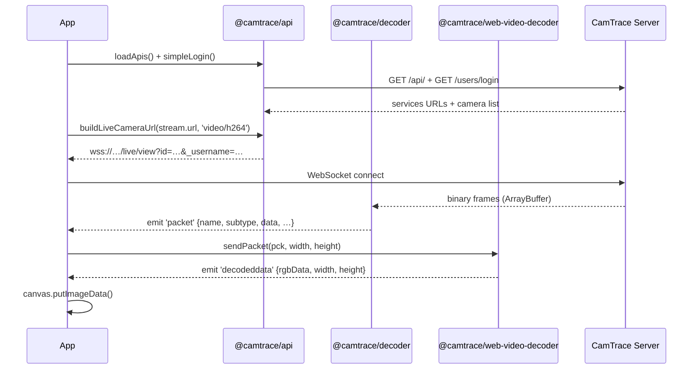
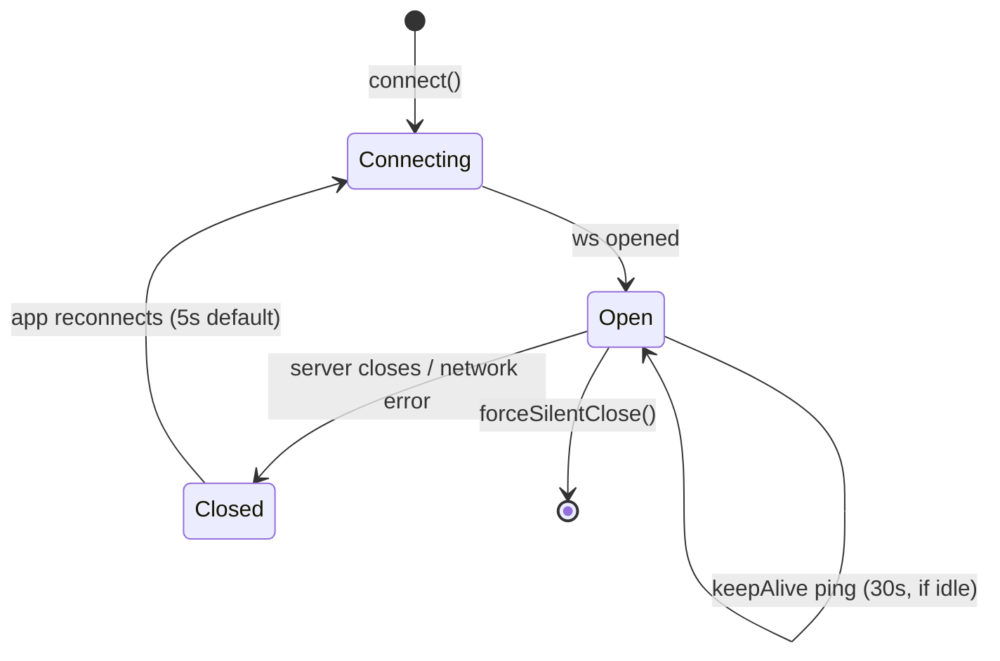
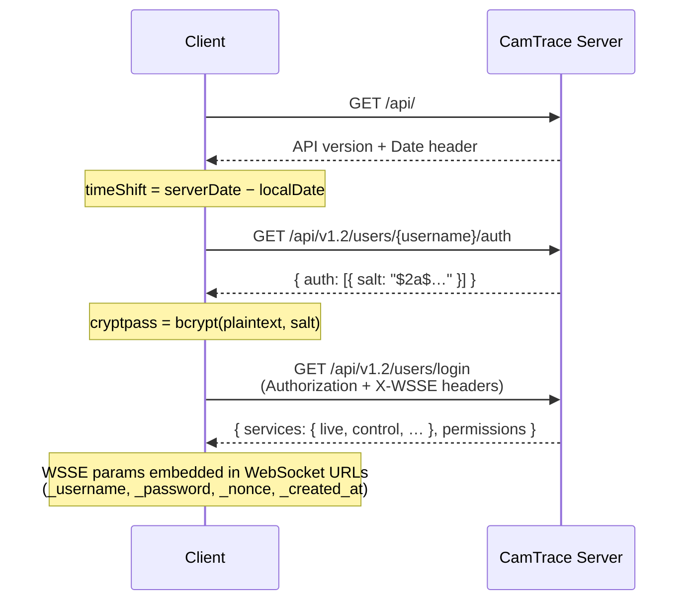

# Architecture

## Overview

The CamTrace SDK consists of four packages that work together to stream live and recorded video from a CamTrace server to a browser canvas.

```
┌─────────────────────────────────────────────────────────────┐
│                        Your Application                      │
└──────────────────────────┬──────────────────────────────────┘
                           │
         ┌─────────────────┼─────────────────┐
         │                 │                 │
  @camtrace/api    @camtrace/streaming  @camtrace/web-video-decoder
  (HTTP client)    (WS lifecycle)       (WASM decoder — optional)
         │                 │
         └────────┬────────┘
                  │
         @camtrace/decoder
         (binary/text parser)
```

- **`@camtrace/api`** authenticates and talks to the CamTrace HTTP API (camera list, service URLs).
- **`@camtrace/decoder`** parses the binary WebSocket frames into typed packets and sends text commands.
- **`@camtrace/streaming`** manages WebSocket connections (keep-alive, reconnect) and provides high-level `LivePlayer` / `PlaybackPlayer` façades.
- **`@camtrace/web-video-decoder`** is a reference FFmpeg-WASM decoder. It is **substitutable** — any decoder that consumes the `packet` events from `@camtrace/decoder` will work (WebCodecs, native SDK, etc.).

## Data flow — Live stream



## Data flow — Record playback

Record playback requires two WebSocket connections opened sequentially. See [Advanced — Record Playback](advanced-player.md) for the full sequence.

## WebSocket connections

Each server session uses up to 5 WebSocket connections:

| Connection | Protocol | Direction | Decoder |
|------------|----------|-----------|---------|
| Control channel | Text (newline-delimited) | bidirectional | `CMDecoder.Control` |
| Live stream | Binary (NAL units) | server→client | `CMDecoder.Live` |
| Live mosaic | Binary | server→client | `CMDecoder.Live` |
| Record control | Text (null-byte-delimited) | bidirectional | `CMDecoder.Record.Control` |
| Record video | Binary (NAL units) | server→client | `CMDecoder.Record.Video` |

## WebSocket lifecycle



`SimpleService` (from `@camtrace/streaming`) manages this lifecycle automatically.

## Authentication flow — WSSE


